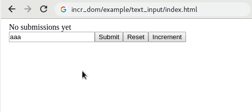

This example illustrates how to keep track of and modify the content
of a text input using the Incr\_dom model instead of solely relying on
the browser to do the state management.

This approach makes dynamic uses of forms more reliable, since it
gives you more control over the content of each input.

## Usage

Follow the build instructions in the example [README](../README.org)
and then navigate to the example in your browser:


The "app" is extremely simple. You can change the text in the input
box manually or by pressing one of the buttons. The "Increment"
button adds 1 to a counter and sets the input to the text "Default
#\<counter\>".


## What is all the code for?

There are two files we care about: *main.ml* and *app.ml*, both in
this directory.

The Main file is typically just a few lines long and its only job is
to start the app and declare which Incr\_dom interface you're using:

```ocaml
open! Core_kernel
open! Incr_dom
open! Js_of_ocaml

let () =
  Start_app.start
    (module App)
    ~bind_to_element_with_id:"app"
    ~initial_model:(App.Model.init ())
```

Here, we call `Start_app.start` to start the app with the `App_intf.S`
interface. It lays out the modules and functions you have to define to
use Incr\_dom.

Let's go through each of these pieces in turn. Recall that Incr\_dom apps
have a
[model-view-controller](https://en.wikipedia.org/wiki/Model%E2%80%93view%E2%80%93controller)
design, where incremental changes to your data (the model) are
automatically reflected in the UI (the view), based on dependencies
you define (roughly, the "controller").

**Model**

A model must implement a type `t` and a function `cutoff` that says
when the model has changed sufficiently to trigger a refiring of the
incremental graph. In this case, our model is simply:

```ocaml
module Model = struct
  type t =
    { counter        : int
    ; input_text     : string
    ; submitted_text : string option
    } [@@deriving sexp, fields, compare]

  [...]
  
  let cutoff t1 t2 = compare t1 t2 = 0
end
```

The `cutoff` function is simple, in that it triggers whenever any of
the fields in `t` is changed (with the comparison functions
auto-generated by `[@@deriving compare]`).

The model also contains a variety of helper functions, like `init` and
`reset_counter` and `incr_counter`, that do what you'd expect.

**Action**

Actions define how to update the model. It's a variant type that's
used in the function `apply_action`, which maps each variant to some
code that actually makes changes to the model. In our example, there
are only four possible actions:

```ocaml
module Action = struct
  type t =
    | Reset_counter
    | Incr_counter
    | Update_input of string
    | Submit_input
  [@@deriving sexp]

  let should_log _ = true
end
```

(Note that we also have to implement the `should_log` function, which
says whether we want to log actions.)

`apply_action` simply delegates these actions to the corresponding
helper function on the model:

```ocaml
let apply_action action model _state ~schedule_action:_ =
  match (action:Action.t) with
  | Reset_counter     -> Model.reset_counter model
  | Incr_counter      -> Model.incr_counter  model
  | Update_input text -> Model.update_input  model text
  | Submit_input      -> Model.submit_input  model
```

It's worth asking why we have the `Action` abstraction in the first
place. Couldn't we just write functions that manipulate models
directly?

Indeed you could, but reifying actions allows you to better debug
them. This isn't so important in an application as simple as this one,
but later on, you'll find that actions help you reason about
e.g. concurrency.

Consider pagination. If your "next" and "prev" buttons are hooked up
to a function that is closed over the current state of the UI, it can
be hard to interpret which page the function thinks you're on at the
time that the function is called. Having an explicit `action` type
makes it clearer which page you're on when it runs.

**State**

We don't use `State` in this application but in general it's used to
manage imperative state outside the Model-View world, for instance, in
an Async RPC client.

**schedule_action**

Imagine having a button you can click that fires off an asynchronous
call to some external server; when the call comes back, you need some
way to tell the model about the result. The `schedule_action` function
provides a hook into the `Action` queue: you schedule an action and
the action updates the model.

**apply_action**

We've seen what this does above. It's the bridge between actions and
the model.

**on_startup**

This function is called once, right after the DOM is initialized. It's
often used to spin up async processes, and it's given hooks to the
`schedule_action` function and to your model so that those processes
can interact with the app.

Here it's just a no-op:

```ocaml
let on_startup ~schedule_action:_ _ = Async_kernel.return ()
```

**on_display**

We don't use `on_display` in this application, but it fires anytime
the DOM is updated. While incr_dom is mostly "value-triggered," in the
sense that the view responds to changes in model values, `on_display`
lets you define behavior that's "edge-triggered." For example, if a
model change triggers the adding 2,000 of rows to a table, you might
want to respond by scrolling the viewport. You're not so much
responding to the model change as you are to the effect it had on
the DOM.

**update_visibility**

This is another function we don't use in this example. It's used when
you want to selectively render parts of the model based on what the
user can see in their viewport (because maybe e.g. you don't want to
render rows of a table that are offscreen).

When this function is called, you can inspect the DOM (using various
helper functions) and update your model to, say, filter out the
offscreen rows, so that only the visible rows are rendered.

There's no general-purpose way for the browser to say when a change to
the DOM might have affected the visibility of some element, and so
this function is usually hooked up via a callback to certain events
that might be relevant to visibility, like scrolling. It is rarely
used in practice.

Here it's just the identity function:

```ocaml
let update_visibility m = m
```

**view**

Since in this case the view defines most of the app's behavior, we'll
unpack it in the section below.

## Understanding the app's behavior

**Dumping DOM on the page**

There's essentially no HTML in this directory, and yet we end up with
text and buttons and an input fields on the page. Where did that stuff
come from?

It came from the `view` function. When we load the page, the
JavaScript we compiled from this file, and in particular the code
defined in `view`, ends up building the DOM node by node.

There are all kinds of possible nodes, which are defined in
[`Virtual_dom.Vdom.Node`](https://ocaml.janestreet.com/ocaml-core/latest/doc/virtual_dom/Virtual_dom__/Node).

So for instance to end up with the HTML:

```html
<body>
  <div>No submissions yet</div>
</body>
```

--we would write:

```ocaml
let submission = Node.div [] [Node.text "No submissions yet"] in
Node.body [] [submission]
```

That's what most of the code in `view` does, is just use the `Vdom`
module and `Node` in particular to build up the elements of our page:
`Node.button` for the buttons, `Node.input` for the input field, and
`Node.div` for the div containing text.

**Refining the incremental graph**

But perhaps more important is that the `view` function is where we
define how exactly changes in the model will affect the UI. This is
why `view` is passed the `Model.t` itself and a function, `inject`,
which it can use to hook up actions to DOM elements.

Here's a simple example: we want the "submission" text to update when
the `Model.submitted_text` changes. Let's leave out everything else
and see what the code looks like:

```ocaml
let view (m : Model.t Incr.t) ~inject:_ =
  let open Incr.Let_syntax in
  let open Vdom in
  let submission =
    let%map submitted_text = m >>| Model.submitted_text in
    let text =
      match submitted_text with
      | None      -> "No submissions yet"
      | Some text -> "Your latest submission was: " ^ text
    in
    Node.div [] [Node.text text]
  in
  Node.body [] [submission]
```

Behaviorally, we're setting things up so that whenever there's `Some
text` in `Model.submitted_text`, like "ASDF", the div will update to
read "Your latest submission was: ASDF".

The trickiest line in here is this one:

```ocaml
let%map submitted_text = m >>| Model.submitted_text in
```

In essence we're taking a big incremental computation -- the one that
decides whether the whole model `m` has changed, and minimally
propagates those changes throughout the incremental graph -- and
carving out a little piece of it, namely, the piece responsible for
saying whether `m.submitted_text` has changed. We do this so that the
text field *only* depends on changes to `m.submitted_text` and
not on changes to the entire model.

Here, there's probably no performance improvement from doing this. But
in general it can make a huge difference in the speed of your app if
you refine your incremental graph so that the entire UI isn't
recomputing anytime any small part of the model changes. The way you
do this is by this `let%map ... >>|` pattern.

(The `let%map` and `>>|` syntax are technically giving you the
applicative subset of the monad. The syntax comes from the `open
Incr.Let_syntax` import.)

So we *could* have written the above code to be the more simple:

```ocaml
let view (m : Model.t Incr.t) ~inject:_ =
  let open Incr.Let_syntax in
  let open Vdom in
  let%map m = m in
  let submission =
    let text =
      match m.submitted_text with
      | None      -> "No submissions yet"
      | Some text -> "Your latest submission was: " ^ text
    in
    Node.div [] [Node.text text]
  in
  Node.body [] [submission]
```

Now the div depends on `m` as a whole and will be re-rendered whenever
any part of the model changes, not just `m.submitted_text`. If that's
unacceptable, another way to achieve a refinement of the dependency
graph is to scope the `let%map m = m` a little tighter:

```ocaml
let view (m : Model.t Incr.t) ~inject:_ =
  let open Incr.Let_syntax in
  let open Vdom in
  let submission =
    let%map m = m in
    let text =
      match m.submitted_text with
      | None      -> "No submissions yet"
      | Some text -> "Your latest submission was: " ^ text
    in
    Node.div [] [Node.text text]
  in
  let%map input_text = m >>| Model.input_text in
  [...]
  Node.body [] [submission]
```

This way, only the UI components in scope have the dependency on
`m`. The components defined in `[...]` will just depend on `Model.input_text`
and won't be re-rendered when `m.submitted_text` changes.

**Using `inject`**

TODO

**Seeing the view -> action -> model -> view loop in action**

The motivation for this example was to show how a tight coupling of a DOM
element -- in this case, an input field -- to the model can allow for
finer control of the DOM, without implicitly relying on the browser
for state. So how does it work?

The relevant code is the code that controls the input field itself:

```ocaml
let%map input =
  let%map input_text = m >>| Model.input_text in
  Node.input
    [ Attr.type_ "text"
    ; Attr.string_property "value" input_text
    ; Attr.on_input (fun _ev text -> inject (Action.Update_input text))
    ]
    []
```

This creates an `<input type="text">` DOM element whose value is set
to `input_text`, with the `Update_input` action hooked up to its
[`input` event](https://developer.mozilla.org/en-US/docs/Web/Events/input).

Note that this `Attr.string_property "value" input_text` is not a
one-time "set it and forget it" operation. `input_text` is actually a
slice of our incremental computation, and so the line is setting up a
dependency such that the input element's "value" attribute will be
updated *every time* the value of `input_text` changes.

The loop is thus: (1) the user changes the value in the input field,
(2) the "input" DOM event fires, (3) the `Update_input` event is
    triggered with that text, (4) the `input_text` value changes on
    the model, and (5) the input field is set to the new value.
    
It's easier to see that this is happening when you perturb the code a
little bit. Let's make it so that model changes *always* set the input
value to the string "aaa":

```ocaml
let%map input =
  let%map _input_text = m >>| Model.input_text in
  Node.input
    [ Attr.type_ "text"
    ; Attr.string_property "value" "aaa"
    ; Attr.on_input (fun _ev text -> inject (Action.Update_input text))
    ]
    []
```

Now we get the following behavior in the browser:


It's as if the input field is "locked" into the value "aaa" -- anytime
we try to change it, it'll be overwritten. Let's say the user types
"f". The `Attr.on_input...` line ensures that we'll update the model. But
updating the model will trigger the incr_dom dependency on
`Model.input_text`, and so we'll fire the code which sets the
input value back to "aaa" again.

The model, though, will have "aaaf" for its value, which we see when
we hit the "Submit" button.

Suppose we also commented out the `Attr.on_input` line:

```ocaml
let%map input =
  let%map _input_text = m >>| Model.input_text in
  Node.input
    [ Attr.type_ "text"
    ; Attr.string_property "value" "aaa"
    (* ; Attr.on_input (fun _ev text -> inject (Action.Update_input text)) *)
    ]
    []
```

Now the model update won't happen as the input field's "input" event
is triggered, and so we're able to type stuff willy-nilly into the
input box, without affecting the model -- which we can see by
repeatedly pressing the "Submit" button.



But as soon as we hit the "Increment" button, the model will get
updated again, and in particular the `Model.input_text` will change,
and so we'll trigger the line that sets "aaa" again, effectively
resetting the field.
